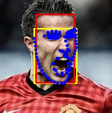
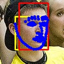
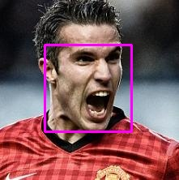
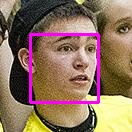
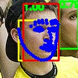

# Introduction
Face Detection Label Maker is a preprocessing tool that can accurately regress the face bounding box using either MTCNN or SLPT (landmark detection algorithm).

---

## Installation
Environment Configuration Method Reference: https://github.com/Jiahao-UTS/SLPT-master

```
pip install -r requirements.txt
```


## Parameter settings

    --net_type: Select Detector(MTCNN or SLPT)
    --return_type: Select the type of return box
          V1：LeftTop_x LeftTop_y width height；V2：LeftTop_x LeftTop_y  RightBottom_x  RightBottom_y；V3: CenterPoint_x CenterPoint_y width height
    --scale： expansion ratio，the face box is: maximum side length*scale, draw square
    --detect_folder: Whether to detect images in folders
    --detect_video:Whether to detect images in video (only work for SLPT mode)
    --path: input path (for single image, folder, video)
    --ouput_path: Path to the output results (only work for SLPT mode)

----

## Run shells

#### For MTCNN mode

Single image:
```
python gen_face_bbx_label_SLPT.py  --path <img_path>  --return_type <v1 or v2 or v3> --scale <number>  --net_type mtcnn
```
one folder:
```
python gen_face_bbx_label_SLPT.py  --path <folder_path>  --return_type <v1 or v2 or v3> --scale <number>  --net_type mtcnn --detect_folder
```
#### For SLPT mode


Single image:
```
python gen_face_bbx_label_SLPT.py  --path <img_path>  --return_type <v1 or v2 or v3> --scale <number>  --net_type SLPT --ouput_path <output_path>
```
folders:
```
python gen_face_bbx_label_SLPT.py  --path <folder_path>  --return_type <v1 or v2 or v3> --scale <number>  --net_type SLPT --detect_folder  --ouput_path <output_path>
```
video:
```
python gen_face_bbx_label_SLPT.py  --path <video_path>  --return_type <v1 or v2 or v3> --scale <number>  --net_type SLPT --detect_video  --ouput_path <output_path>
```

---

## Result Storage

#### For mtcnn mode
The results will be saved in a folder at the same level as the input folder. The folder will be named as follows: `vis_{args.return_type}{args.net_type}` or `vis{args.return_type}_{args.net_type}_singleimage`. For example: `vis_v1_mtcnn` or `vis_v1_mtcnn_singleimage`.

Additionally, a text file result will be generated, named as: `output_{args.scale}{args.net_type}{args.return_type}.txt` (e.g., `output_1.0_mtcnn_v1.txt`).

#### For SLPT mode
Several folders will be generated to store the results at different stages. Taking the detect _folder_ as an example:

**output_log:* Stores log information, including four log cases: normal detection, no face detected, multiple faces detected, and wrong face aspect ratio detected.

**output_path:* Stores the detected face bounding box results. The red box represents the face detection result, the blue dots indicate the detected facial landmarks, and the yellow box is drawn based on the landmarks.

**vis_box:* Visualizes the final bounding box according to the scale.

**warning_result:*  Stores three types of error messages.
1. If no face is detected, the original image will be copied to the "warning_result/No_Face" folder. 
2. If multiple faces are detected, relevant information will be visualized in the "warning_result/Multi_face" folder. The red box represents the face detection result, the blue dots indicate the landmarks, and the yellow box is drawn based on the landmarks.Other detected human face boxes are represented by green boxes, and the information on the boxes includes confidence information. 
3. If there is a problem with the aspect ratio of the detected face, relevant information will be visualized in the "warning_result/Warning_WH", which is the same as when multiple faces are detected.

#### Visualization

1. original vis:


2. result(coarse box and landmark) vis




3. final box vis



4. warning vis

Noted:  aspect_ratio is not normal, detect multi face or no face



---
## Lincese
This work is developed under the MIT Licenses.
